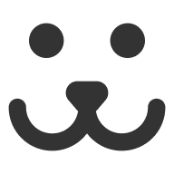

    
    
    
    

 

<h2>🔖 Descrição</h2>

🐕 Criação da aplicação Dogs, uma rede social para cachorros criada no curso de React da Origamid.

 

<h2>🚀 Tecnologias</h2>
<ul>
    <li><a href="https://create-react-app.dev/" target="_blank">React</a></li>
    <li><a href="https://reactrouter.com/" target="_blank">React Router</a></li>
    <li><a href="https://github.com/FormidableLabs/victory" target="_blank">Victory</a></li>
</ul>

 

<h2>ℹ️ Como utilizar</h2>

    Clone esse repositório
    $ git clone https://github.com/igortuag/dogs

    Instalar dependências
    $ yarn

    Inicie o projeto
    $ yarn start

 
Feito com ❤️ por <a href="https://linkedin.com/in/igortuag" target="_blank">Igor Tuag</a>

